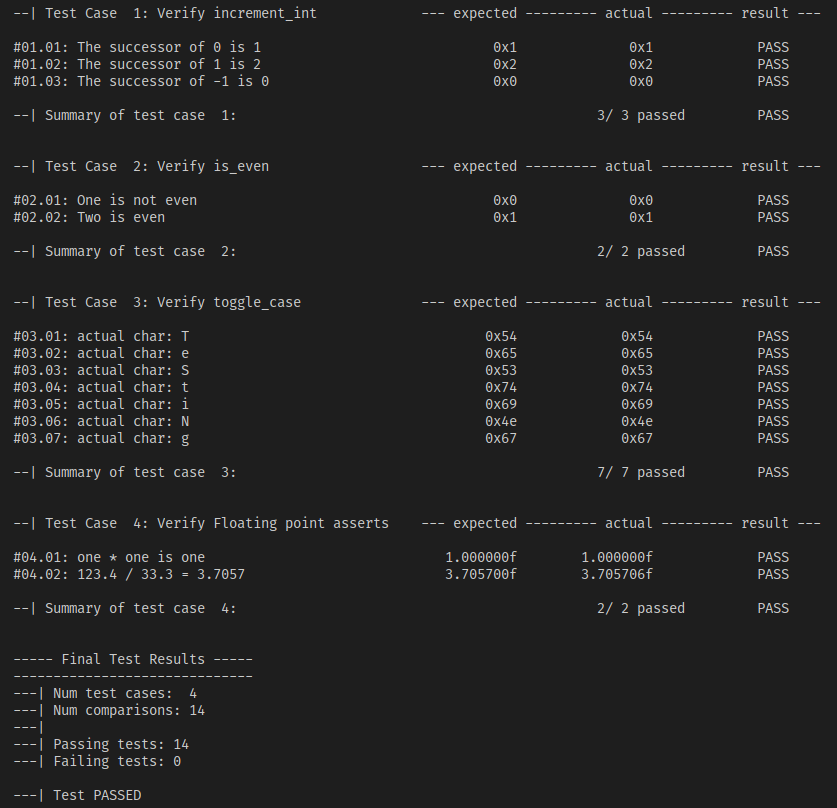

# Simple and rudimentary unit testing framework for the C programming language. 

## This repository contains the c_test_lib library to assist in writing and running unit tests, as well as the structure and support for a c-language project.

## *** This is in its very early stages. For now you can compare unsigned 32 bit integers only ***

## Project Structure:
- Your .c source files go in ./src/
- Your .h header files go in ./include/
- Your .c test files go in ./test/
- Object and .out files are automatically generated in ./bin/ after compiling with the included make utility.
- There are example files in each directory to demo the intended project structure.

## A makefile is included with the following features:
- run your main application
- run any tests you have written
- debug your main application with gdb
- debug your tests code with gdb
- clean the ./bin/ directory

## To run your main application without testing:
- Put your .c file with a main function in the ./src/ directory.
- To compile your main application: $ make
- To run your main application: $ make run 
- to clean: $ make clean

## To write and run tests:
- Put your .h and .c project files in the ./include/ and ./src/ directories.
- Create a .c file in the ./test/ directory to write your tests in. Follow the test_example_code.c file for guidance.
- to compile the tests: $ make tests
- to run the tests: $ make run-tests
- to clean: $ make clean

## To debug your main application:
- Follow the steps above to compile your main application
- To debug with the gbd debugger: make run-debug

## To debug your test code:
- Follow the steps above to compile the tests
- To debug the test code with the gbd debugger: make run-debug-tests
 
## Sample test output for the test_example_code.c file is shown below:

